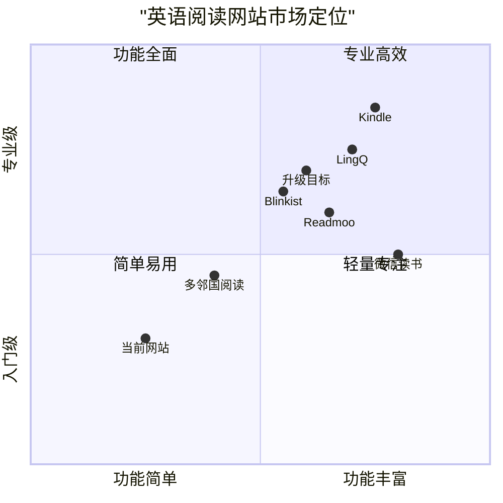

# 英语阅读网站增强 PRD

## 1. 概述

### 1.1 项目背景

当前的英语阅读网站提供了基础的阅读功能和管理员后台，但整体用户体验、视觉设计和功能性还有提升空间。本次升级旨在从交互、视觉和功能三个维度全面提升网站品质，打造更加专业、易用的英语阅读平台。

### 1.2 项目目标

1. **提升用户体验**：优化网站交互设计，使阅读流程更加顺畅直观
2. **改进视觉设计**：更新网站视觉风格，提供现代化、专业的用户界面
3. **扩展核心功能**：增强阅读功能，提供更多实用工具和个性化体验

### 1.3 目标用户

- 英语学习者：希望通过阅读提高英语水平的学习者
- 阅读爱好者：喜欢阅读英文原版书籍的用户
- 教育从业者：需要组织和管理英语阅读材料的教师和教育工作者
- 网站管理员：负责内容更新和用户管理的后台管理人员

## 2. 竞品分析

### 2.1 主要竞品对比



### 2.2 竞品优缺点分析

| 产品 | 优点 | 缺点 |
|------|------|------|
| Kindle | 专业的阅读体验、强大的笔记功能、跨设备同步 | 学习功能较弱、社区互动有限 |
| Readmoo | 丰富的图书资源、良好的视觉体验 | 英语学习工具不足、定位偏向一般阅读 |
| 微信读书 | 社交阅读、内容推荐、便捷的划线功能 | 英语学习特性不强、广告较多 |
| 多邻国阅读 | 针对语言学习者、渐进式难度、游戏化设计 | 高级阅读功能有限、长篇阅读体验一般 |
| LingQ | 强大的语言学习功能、单词收集系统 | 界面设计较旧、用户体验一般 |
| Blinkist | 内容精选、简洁界面、核心内容提炼 | 仅提供摘要、完整阅读体验欠缺 |

## 3. 功能需求

### 3.1 视觉设计提升

#### 3.1.1 整体设计风格
- MUST 设计现代简洁的视觉语言
- MUST 建立统一的色彩系统
- MUST 优化排版和文字层级
- SHOULD 增加专业插图和图标系统
- MAY 添加适当的动效和过渡

#### 3.1.2 响应式设计
- MUST 实现全面响应式布局
- MUST 确保移动端阅读体验
- MUST 优化不同尺寸设备的排版
- SHOULD 针对平板设备优化横向布局

### 3.2 交互体验优化

#### 3.2.1 阅读体验
- MUST 实现可定制的阅读模式（日间/夜间/护眼）
- MUST 添加可调节的文字大小、行距和边距
- MUST 改进单词/句子选择机制
- SHOULD 添加手势控制导航
- MAY 添加页面翻转动画

#### 3.2.2 导航优化
- MUST 实现面包屑导航
- MUST 添加快速返回顶部按钮
- MUST 改进图书分类和筛选
- SHOULD 添加带自动建议的搜索功能

### 3.3 功能增强

#### 3.3.1 用户功能
- MUST 实现用户个人资料和阅读历史
- MUST 添加书签和注释功能
- MUST 实现阅读进度同步
- SHOULD 添加阅读统计和成就系统
- MAY 添加手动收藏和偏好设置

#### 3.3.2 管理员功能
- MUST 改进图书上传界面，支持拖放操作
- MUST 添加图书上传时的分类系统
- MUST 添加批量操作图书管理功能
- MUST 实现增强的元数据管理
- SHOULD 添加数据分析看板
- MAY 添加用户管理功能

#### 3.3.3 内容发现功能
- MUST 实现强大的图书搜索功能
- MUST 实现个人阅读列表和收藏
- MUST 添加图书标签和分类系统
- MAY 添加阅读目标和成就追踪

### 3.4 技术改进

#### 3.4.1 性能优化
- MUST 实现图书列表的懒加载
- MUST 优化图片加载和缓存
- MUST 提高页面加载速度
- SHOULD 实现渐进式网页应用功能

#### 3.4.2 跨平台兼容性
- MUST 确保响应式设计适配所有屏幕尺寸
- MUST 实现离线阅读功能
- SHOULD 添加移动设备特定优化

## 4. 需求池

### 4.1 P0 (必须实现)
1. 增强的阅读界面和自定义选项
2. 改进的图书管理系统
3. 用户资料和阅读进度追踪
4. 响应式设计和跨设备同步
5. 个人图书馆组织系统

### 4.2 P1 (应该实现)
1. 强大的搜索和筛选功能
2. 图书分类系统
3. 阅读统计和成就
4. 管理员数据分析看板
5. 离线阅读功能

### 4.3 P2 (可以实现)
1. 增强的阅读游戏化功能
2. 高级注释工具
3. 与外部阅读服务集成
4. 扩展的图书元数据和标签系统

## 5. UI设计草图

### 5.1 首页布局
```
+------------------+
|  页眉            |
+------------------+
|  搜索栏          |
+------------------+
|  分类            |
+------------------+
|                  |
|  推荐图书        |
|  (卡片网格)      |
|                  |
+------------------+
|  最近阅读        |
|  (横向滚动)      |
+------------------+
|  页脚            |
+------------------+
```

### 5.2 阅读器界面
```
+------------------+
|  导航栏          |
+------------------+
|  章节选择        |
+------------------+
|                  |
|                  |
|  阅读内容        |
|                  |
|                  |
+------------------+
|  工具栏          |
|  (翻译/朗读/笔记)|
+------------------+
|  进度条          |
+------------------+
```

## 6. 开放问题

1. 集成策略
   - 如何将新功能与现有代码库集成？
   - 现有数据的迁移计划是什么？

2. 性能考量
   - 如何有效处理大型图书文件？
   - 离线存储的策略是什么？

3. 图书分类系统
   - 应包括哪些分类类别？
   - 如何高效实现跨分类搜索？

4. 技术实现
   - 选用哪种翻译API以获得最佳性能？
   - 如何一致地处理不同的图书格式？

## 7. 实施时间表

第一阶段（4周）：
- 视觉设计更新
- 基础阅读体验改进
- 用户个人资料系统

第二阶段（4周）：
- 高级阅读功能
- 个人图书馆组织
- 管理员面板增强

第三阶段（2周）：
- 性能优化
- 测试和错误修复
- 发布准备