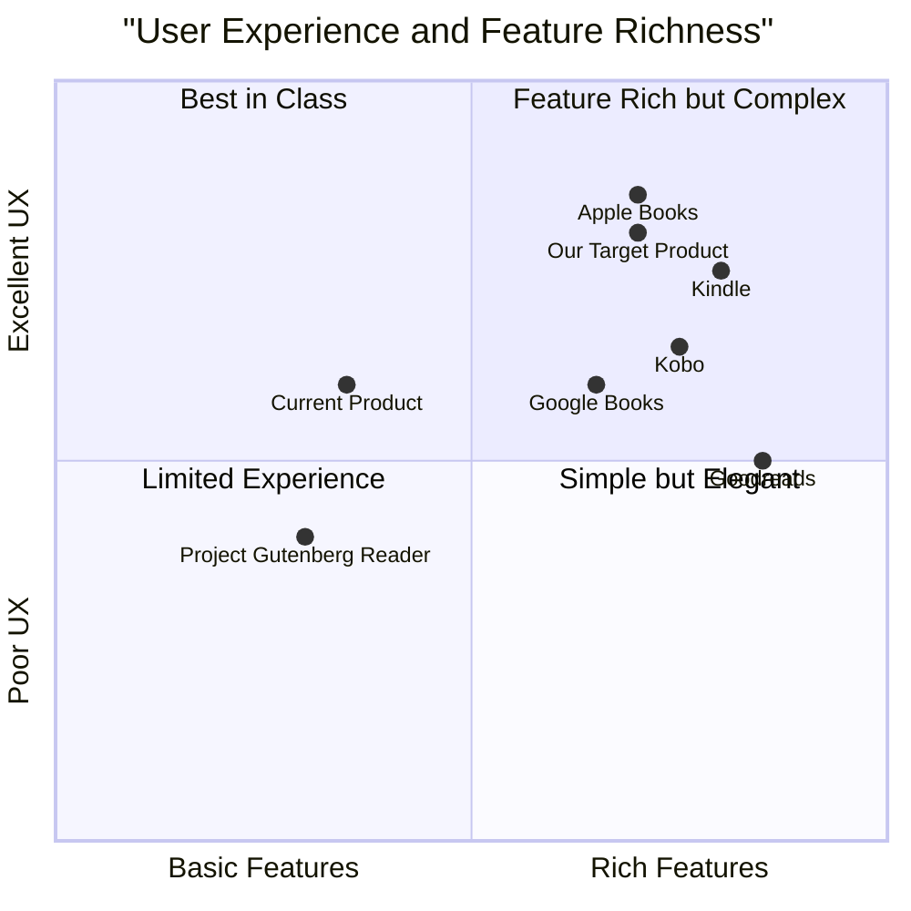

# User Functionality Enhancement PRD

*Product Requirements Document*

**Project Name:** english_book_reader_user_functions

**Author:** Emma (Product Manager)

**Date:** 2025-03-13

**Original Requirements:** 添加用户功能，用户可以登录（包括使用Google和GitHub的OAuth登录选项），收藏书籍到书架，会自动保存用户的阅读进度。

## 1. Introduction

### 1.1 Purpose
This document outlines the requirements for enhancing the existing English book reading website with user account functionality, personal bookshelves, and automatic reading progress tracking.

### 1.2 Scope
The enhancement will focus on creating a personalized reading experience through user authentication, book collection management, and seamless reading progress synchronization.

### 1.3 Definitions
- **User Account**: Personal login credentials and profile information
- **Bookshelf**: Personalized collection of saved books
- **Reading Progress**: The last read position in a book
- **Favorites**: Books marked as favorites by the user

## 2. Product Definition

### 2.1 Product Goals
1. Enable users to create and manage personal accounts
2. Allow users to build and organize personal book collections
3. Provide seamless reading experience with automatic progress tracking

### 2.2 User Stories
1. As a frequent reader, I want to create a personal account so that I can access my books across different devices.
2. As a reader, I want to save books to my personal bookshelf so that I can easily find and continue reading them later.
3. As a user, I want my reading progress to be saved automatically so that I can resume reading from where I left off.
4. As a book enthusiast, I want to mark books as favorites so that I can quickly access my preferred content.
5. As a user, I want to see my reading statistics so that I can track my reading habits over time.

### 2.3 Competitive Analysis

| Product | Pros | Cons |
|---------|------|------|
| Kindle | Strong progress syncing, extensive library | Closed ecosystem, limited customization |
| Google Books | Seamless cloud sync, accessible anywhere | Limited social features, basic UI |
| Apple Books | Beautiful UI, seamless device integration | Limited to Apple ecosystem |
| Kobo | Great reading statistics, achievement system | Smaller library, less intuitive UI |
| Goodreads | Strong community features, comprehensive tracking | Not a primary reading platform, limited reader |
| Project Gutenberg Reader | Open source, accessible | Basic features, limited progress tracking |
| Our Target Product | Personalized experience, progress tracking, favorites | Currently lacks user accounts |

### 2.4 Competitive Quadrant Chart



## 3. Technical Specifications

### 3.1 Requirements Analysis

To implement user functionality, we need to develop a comprehensive authentication system, user profile management, bookshelf functionality, and reading progress tracking. The system must securely store user data while providing a seamless and intuitive user experience.

### 3.2 Requirements Pool

#### P0 (Must-have)
1. User registration and login system with secure authentication
   - Email/password registration
   - OAuth login options with Google and GitHub
   - Login/logout functionality
   - Session management
   - Password reset capability

2. Personal bookshelf functionality
   - Add books to bookshelf
   - Remove books from bookshelf
   - View all saved books

3. Reading progress tracking
   - Automatic saving of current reading position
   - Resume reading from last position
   - Progress indicator (percentage, page number)

#### P1 (Should-have)
1. User profile page
   - Basic profile information
   - Reading statistics
   - Recently read books

2. Book organization features
   - Categorize books on bookshelf
   - Sort books by different criteria (title, author, recently read)

3. Favorites functionality
   - Mark/unmark books as favorites
   - Filtered view for favorite books

#### P2 (Nice-to-have)
1. Enhanced bookshelf management
   - Create custom collections
   - Add tags to books
   - Search within bookshelf

2. Cross-device synchronization
   - Seamless experience across different devices
   - Offline mode with local storage

### 3.3 UI Design Draft

#### 3.3.1 User Authentication UI
- Clean, minimal login and registration forms
- Clear error messaging
- Password strength indicator
- OAuth login buttons for Google and GitHub integration
- Visual distinction between traditional and OAuth login options

#### 3.3.2 User Profile UI
- Profile header with user information
- Recently read books carousel
- Account settings section

#### 3.3.3 Bookshelf UI
- Grid/list view toggle
- Cover-focused design with progress indicators
- Quick-access favorites section
- Sort and filter options
- Responsive design for different screen sizes

#### 3.3.4 Reading Progress Integration
- Subtle progress bar at bottom of reader
- Last read notification when opening book
- Reading session summary when closing book

### 3.4 Open Questions

1. **Data Persistence Strategy**: Should we use local storage, server-side database, or a hybrid approach for storing reading progress?
2. **Authentication Method**: Should we implement our own authentication or leverage existing solutions like Auth0 or Firebase Authentication?
3. **Performance Considerations**: How frequently should reading progress be saved to balance accuracy and performance?
4. **Data Privacy**: What user data should be collected and how will it be protected?
5. **Offline Functionality**: How comprehensive should offline support be?

## 4. Implementation Timeline

### 4.1 Phase 1: Core User Functionality (4 weeks)
- User authentication system
- Basic profile functionality
- Database schema and API endpoints

### 4.2 Phase 2: Bookshelf & Progress Tracking (3 weeks)
- Bookshelf implementation
- Reading progress tracking
- Favorites functionality

### 4.3 Phase 3: UI Enhancements and Testing (2 weeks)
- UI refinements
- Performance optimizations
- User testing and feedback

## 5. Success Metrics

### 5.1 User Engagement
- 50% of users create accounts within first month
- 40% of new accounts use OAuth login options (Google or GitHub)
- 70% of logged-in users save at least one book to bookshelf
- 80% return rate for users with saved books

### 5.2 Feature Adoption
- 60% of users utilize reading progress continuation
- 40% of users mark at least one book as favorite
- Average session time increases by 25%

### 5.3 Technical Performance
- Reading progress saves complete in under 200ms
- Authentication processes complete in under 1 second
- 99.9% uptime for user-related services

## 6. Technical Architecture

### 6.1 Authentication System
- JWT-based authentication
- Secure password hashing using bcrypt
- OAuth 2.0 integration with Google and GitHub
- Session management with appropriate timeouts
- HTTPS implementation for all data transfer
- Cross-Site Request Forgery (CSRF) protection for OAuth flows

### 6.2 Data Models

#### User Model
```javascript
const UserSchema = {
  id: String,
  username: String,
  email: String,
  passwordHash: String, // Null if OAuth user
  createdAt: Date,
  lastLoginAt: Date,
  profile: {
    displayName: String,
    preferences: Object,
    avatarUrl: String // Profile picture from OAuth provider
  },
  authProvider: {
    type: String, // 'local', 'google', 'github'
    providerId: String, // Provider's unique user identifier
    accessToken: String, // Optional, encrypted
    refreshToken: String // Optional, encrypted
  }
}
```

#### Bookshelf Model
```javascript
const BookshelfSchema = {
  userId: String,
  books: [
    {
      bookId: String,
      addedAt: Date,
      isFavorite: Boolean,
      lastOpenedAt: Date,
      collections: [String]
    }
  ]
}
```

#### Reading Progress Model
```javascript
const ReadingProgressSchema = {
  userId: String,
  bookId: String,
  position: Number, // percentage or location
  updatedAt: Date,
  totalPages: Number,
  currentPage: Number,
  bookmarks: [{
    position: Number,
    note: String,
    createdAt: Date
  }]
}
```

### 6.3 API Endpoints

#### Authentication
- POST /api/auth/register
- POST /api/auth/login
- GET /api/auth/google
- GET /api/auth/google/callback
- GET /api/auth/github
- GET /api/auth/github/callback
- POST /api/auth/logout
- POST /api/auth/reset-password

#### User Profile
- GET /api/users/profile
- PUT /api/users/profile

#### Bookshelf
- GET /api/bookshelf
- POST /api/bookshelf/book
- DELETE /api/bookshelf/book/:id
- PUT /api/bookshelf/book/:id/favorite

#### Reading Progress
- GET /api/progress/:bookId
- PUT /api/progress/:bookId
- GET /api/progress/recent

## 7. Conclusion

The addition of user functionality including authentication, personal bookshelves, and reading progress tracking will significantly enhance the English book reading website. These features will provide users with a personalized reading experience that makes it easier to manage their book collection and continue reading seamlessly across sessions. By focusing on these core user needs, we can create a more engaging and valuable platform for English language readers.